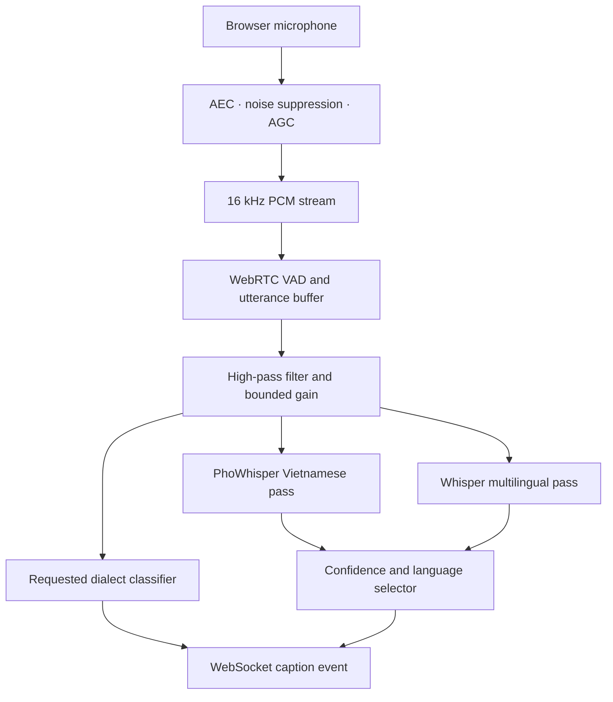

# Vietnamese Meeting STT

Real-time, self-hosted captions for a virtual meeting room, optimized for distant
microphones and conversations that switch between Vietnamese and English.

## Important model note

The requested checkpoint,
[`hr16/PhoWhisper-small-vispeech-classifier-v3`](https://huggingface.co/hr16/PhoWhisper-small-vispeech-classifier-v3),
is an **audio classifier**, not an automatic speech-recognition decoder. It predicts
eight gender/dialect labels and was fine-tuned from `vinai/PhoWhisper-small`.

This project therefore uses the model in the role it was trained for:

- `hr16/PhoWhisper-small-vispeech-classifier-v3`: optional acoustic speaker profile.
- `vinai/PhoWhisper-medium`: primary Vietnamese transcript candidate (default; suited to 12 GB+ NVIDIA GPUs).
- `openai/whisper-small`: optional second pass for English and VI/EN code-switching.

The candidate selector prefers PhoWhisper for Vietnamese and uses the multilingual
candidate when it detects English/code-switching with comparable confidence. Set
`ENABLE_MIXED_ASR=false` to reduce memory use.

> The speaker-profile output is experimental, can be wrong, and must not be used to
> infer identity or make consequential decisions. It is not speaker diarization.

## Pipeline



The browser requests echo cancellation, noise suppression, and automatic gain
control. On the server, VAD preserves a 300 ms pre-roll, ignores short noises,
segments on 700 ms silence, removes low-frequency room rumble, and applies bounded
RMS gain. This helps a distant microphone without amplifying silence indefinitely.

## Quick start

Requirements: Python 3.10–3.12, `libsndfile`, and ideally an NVIDIA GPU with at
least 12 GB VRAM when PhoWhisper-medium, the mixed-language model, and the classifier are enabled.

```bash
cp .env.example .env
python -m venv .venv
source .venv/bin/activate          # Windows: .venv\Scripts\activate
python -m pip install --upgrade pip
pip install -e .
meeting-stt
```

Open <http://localhost:8000>, allow microphone access, and select the room
microphone. The first start downloads model weights from Hugging Face.

For a CPU-only demonstration, edit `.env`:

```dotenv
DEVICE=cpu
TORCH_DTYPE=float32
ENABLE_MIXED_ASR=false
ENABLE_CLASSIFIER=false
```

CPU inference is functional but may not keep up with a busy live meeting.

## Docker

```bash
docker compose up --build
```

The included image is CPU-compatible. For NVIDIA deployment, install NVIDIA
Container Toolkit, use a CUDA PyTorch base image, and add a GPU device reservation
to Compose.

## Configuration

| Variable | Default | Purpose |
|---|---|---|
| `CLASSIFIER_MODEL_ID` | requested `hr16/...-v3` | Gender/dialect acoustic tagger |
| `VIETNAMESE_ASR_MODEL_ID` | `vinai/PhoWhisper-medium` | Primary Vietnamese ASR candidate |
| `MIXED_ASR_MODEL_ID` | `openai/whisper-small` | English/code-switch ASR candidate |
| `DEVICE` | `auto` | `cuda`, `mps`, or `cpu` override |
| `VAD_AGGRESSIVENESS` | `2` | 0 accepts more sound; 3 rejects more noise |
| `END_SILENCE_MS` | `700` | Silence that ends an utterance |
| `MAX_GAIN_DB` | `24` | Maximum far-field amplification |
| `HIGH_PASS_HZ` | `80` | Removes HVAC/handling rumble |

See [`.env.example`](.env.example) for every option.

## Browser streaming protocol

Connect to `/ws/transcribe`. After a `ready` JSON event, send little-endian,
mono PCM16 frames at 16 kHz. The bundled client sends 20 ms (320-sample) frames.
The server returns:

```json
{
  "type": "transcript",
  "segment": {
    "text": "Chúng ta review the deployment plan.",
    "language": "mixed",
    "started_at_ms": 1240,
    "ended_at_ms": 4860,
    "confidence": 0.81,
    "model": "openai/whisper-small",
    "speaker_profile": {
      "label": "female, southern dialect",
      "confidence": 0.72
    }
  }
}
```

Send the text message `flush` when the microphone stops to transcribe the final
partial utterance.

## Far-field production recommendations

Software cannot recover speech that the microphone did not capture. For a real
meeting room:

1. Use a ceiling/table microphone array with beamforming and acoustic echo
   cancellation; keep it away from speakers and HVAC outlets.
2. Send the post-beamforming mono channel to this service. Do not mix multiple
   unsynchronized microphones in the browser.
3. Calibrate `VAD_AGGRESSIVENESS`, `MAX_GAIN_DB`, and microphone gain with real room
   recordings at the farthest participant position.
4. For overlapping speakers, add a dedicated diarization service. The supplied
   classifier describes acoustic classes and cannot separate speakers.
5. Evaluate with Vietnamese/English code-switch recordings from the target room;
   report WER separately for near/far positions and each language.

## Development

```bash
pip install -e '.[dev]'
ruff check .
pytest
```

Tests do not download model weights. Model loading is intentionally deferred to
application startup.

## Privacy

The reference server keeps utterances in memory only. It does not write recordings
or transcripts to disk. Add authentication and TLS before exposing it beyond a
trusted network. If you add storage, obtain participant consent and define a clear
retention policy.

## License

Application code is MIT licensed. Model weights and datasets keep their respective
upstream licenses and terms; review them before commercial deployment.

